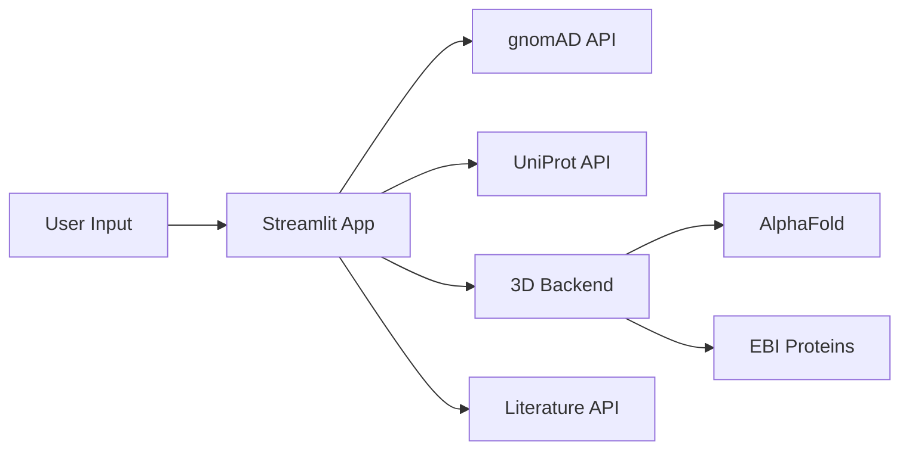

# VarViz3D
🧬 Integrated Variant Analysis Platform with 2D/3D Visualization

## 🎯 Overview
VarViz3D is a comprehensive platform for genetic variant analysis that combines 2D gene-level visualization with interactive 3D protein structure mapping. It integrates real-time data from gnomAD, ClinVar, UniProt, and AlphaFold to provide researchers with a complete view of genetic variation impacts.

## ✨ Key Features
- **2D Gene Visualization**: Interactive plots showing variant distributions across genes with gnomAD allele frequencies
- **3D Protein Structure**: Real-time variant mapping on AlphaFold and PDB structures with heatmap overlays
- **Multi-Source Integration**: Live data from gnomAD, ClinVar, UniProt, Ensembl, and EBI Proteins API
- **Literature Mining**: Automated variant extraction from scientific literature via LitVar
- **Domain Mapping**: Protein domain visualization with interactive highlighting
- **rsID Support**: Direct lookup and highlighting of specific variants

## 🚀 Quick Start

### Prerequisites
- Python 3.10+
- Node.js (for NGL viewer)
- 8GB RAM minimum

### Installation
```bash
# Clone repository
git clone https://github.com/your-team/varviz3d.git
cd varviz3d

# Create virtual environment 
conda create -n varviz3d
conda activate varviz3d

# Install dependencies
conda install --file requirements.yml

# Or in one command
conda create -n varviz3d --file requirements.yml
```

### Running the Platform
```bash
# Terminal 1: Start 3D backend
python backend_3d.py

# Terminal 2: Start main application
streamlit run app.py

# Terminal 3: Start literature API (optional)
uvicorn main:app --port 8000

## Or use start_services.sh (in debug)
chmod +x start_services.sh
start_services.sh
```

Access the platform at:
- 🌐 **Main App**: http://localhost:8501
- 🧬 **3D Viewer**: http://localhost:5001/3d/viewer
- 📚 **Literature API**: http://localhost:8000

## 📊 Usage Examples

### Basic Gene Analysis
1. Open sidebar and enter gene symbol (e.g., "BRCA1", "TP53")
2. Click "Set Gene" to load data
3. Navigate tabs for different views:
   - **2D Overview**: Gene structure, variant distribution, ClinVar annotations
   - **3D Structure**: Interactive protein viewer with variant heatmaps
   - **Literature**: Curated variant mentions from publications

### Advanced Features
```python
# Highlight specific variant
Enter rsID: rs80357906
Click "Highlight" to mark position in both 2D and 3D views

# Adjust visualization parameters
Bin Size: 50-500 (for variant aggregation)
Window Size: 10-100 (for smoothing)
Dataset: gnomad_r4 or gnomad_r3
```

## 🏗️ Architecture

```
varviz3d/
├── README.md                 # Project description markdown
├── start_services.sh         # Starting wrapper script
├── dev/                      # Development and backup directory
├── varviz3d_ux/
   ├── app.py                 # Main Streamlit interface
   ├── backend_3d.py          # Flask API for 3D visualization
   ├── gnomad_viz.py          # gnomAD/ClinVar data processing and 2D visualization
   ├── literature_agent.py    # Simple literature mining module
   ├── static/                # 3D Viewer NGL configuration
       ├── 3d/
           ├── viewer.html    # NGL 3D viewer interface
   ├── gene_to_uniprot.py     # Gene symbol resolution
   ├── app/                   # Full literature mining module
       ├── main.py
       ├── pipeline.py
       ├── config.py
       ├── entrez.py
       ├── functional_summary.py
       ├── gene_info.py
       ├── gene_overview.py
       ├── http_session.py
       ├── litvar_api.py
       ├── litvar_entrez_cache.sqlite
       ├── litvar.py
       └── textutil.py
```

### Data Flow


## 🔧 Configuration

### API Endpoints
- **gnomAD GraphQL**: https://gnomad.broadinstitute.org/api
- **UniProt REST**: https://rest.uniprot.org
- **AlphaFold**: https://alphafold.ebi.ac.uk
- **Ensembl**: https://rest.ensembl.org

### Performance Tuning
```python
# In gnomad_viz.py
GNOMAD_SESSION = create_gnomad_session()  # Connection pooling
timeout=(5, 30)  # Connection and read timeouts

# In app.py
st.set_page_config(layout="wide")  # Full-width layout
```

## 📚 API Documentation

### 3D Backend Endpoints

**Get Variant Tracks**
```http
GET /api/tracks/{uniprot_id}?win={window_size}
```

**Find rsID Position**
```http
GET /api/rspos/{uniprot_id}/{rsid}
```

**Get Protein Domains**
```http
GET /api/domains/{uniprot_id}
```

## Future (in development) 
### 🧪 Testing

```bash
# Test gnomAD connection
python -c "import gnomad_viz; print(gnomad_viz.lookup_gene('BRCA1'))"

# Test 3D backend
curl http://localhost:5001/api/resolve/BRCA1

# Run full test suite
pytest tests/ -v
```

### 🚢 Deployment

#### Docker Deployment
```dockerfile
FROM python:3.10-slim
WORKDIR /app
COPY requirements.txt .
RUN pip install -r requirements.txt
COPY . .
EXPOSE 8501 5001
CMD ["sh", "-c", "python backend_3d.py & streamlit run app.py"]
```

#### Cloud Deployment
```bash
# Deploy to Streamlit Cloud
# 1. Push to GitHub
# 2. Connect at share.streamlit.io
# 3. Set secrets for API keys

# Deploy to Heroku
heroku create varviz3d
heroku buildpacks:set heroku/python
git push heroku main
```

## 🐛 Troubleshooting

| Issue | Solution |
|-------|----------|
| gnomAD timeout | Reduce gene region size or use fallback data |
| 3D viewer blank | Check backend_3d.py is running on port 5001 |
| Layout issues | Clear browser cache, use Chrome/Firefox |
| Memory error | Increase Docker memory to 4GB minimum |

## 🤝 Contributing

1. Fork the repository
2. Create feature branch (`git checkout -b feature/new-visualization`)
3. Commit changes (`git commit -m 'Add new visualization'`)
4. Push to branch (`git push origin feature/new-visualization`)
5. Open Pull Request

### Development Setup
```bash
# Install dev dependencies
pip install -r requirements-dev.txt

# Run linting
flake8 . --max-line-length=120

# Format code
black . --line-length=120
```

## 📄 License
MIT License - see LICENSE file for details

## 🙏 Acknowledgments
- gnomAD team for variant frequency data
- AlphaFold team for protein structures
- NGL viewer developers
- Streamlit community

## Contribution Guidelines
To contribute to VarViz3D, please, [open a pull request](https://github.com/sukhanovaxenia/VarViz3D/compare). Note, that externally pull requests merge has not been set up yet. Hence, if you agree, the changes will be tested and submitted internally with further mentioning of your contribution in our [release notes](https://github.com/sukhanovaxenia/VarViz3D/releases). We apologize for any inconvenience.

If you have any difficulty using VarViz3D, feel free to open an [issue](https://github.com/sukhanovaxenia/VarViz3D/issues/new). If you have general questions not specific to the exact interface, we recommend that you post on a community discussion forum such as [BioStars](https://www.biostars.org).

## 📞 Support
- Issues: [GitHub Issues](https://github.com/your-team/varviz3d/issues)
- Discussions: [GitHub Discussions](https://github.com/your-team/varviz3d/discussions)
- Emails: 
- - , Yuliya Barablina
- - , Daria Panchenko
- - , Omad Saidov
- - sukhanovaeniad@gmail.com, Sukhanova Xenia
- - , Ivan Tsalkovsky