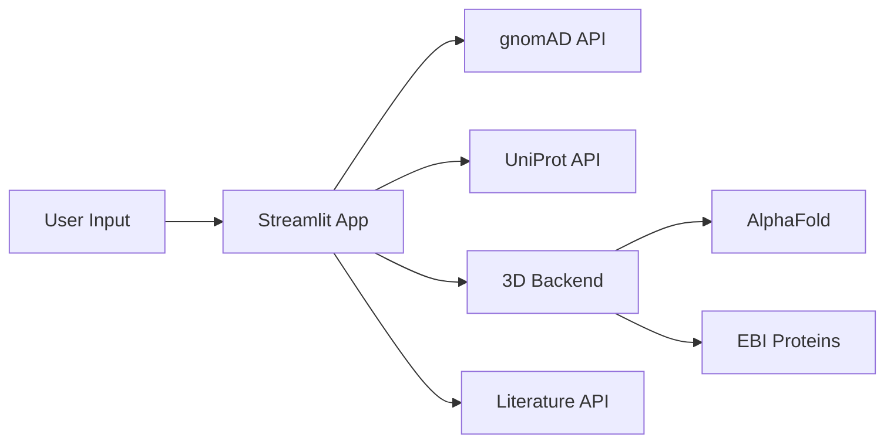

# VarViz3D
🧬 Integrated Variant Analysis Platform with 2D/3D Visualization

## 🎯 Overview
VarViz3D is a comprehensive platform for genetic variant analysis that combines 2D gene-level visualization with interactive 3D protein structure mapping. It integrates real-time data from gnomAD, ClinVar, UniProt, and AlphaFold to provide researchers with a complete view of genetic variation impacts.

## ✨ Key Features
- **2D Gene Visualization**: Interactive plots showing variant distributions across genes with gnomAD allele frequencies
- **3D Protein Structure**: Real-time variant mapping on AlphaFold and PDB structures with heatmap overlays
- **Multi-Source Integration**: Live data from gnomAD, ClinVar, UniProt, Ensembl, and EBI Proteins API
- **Literature Mining**: Automated variant extraction from scientific literature via LitVar
- **Domain Mapping**: Protein domain visualization with interactive highlighting
- **rsID Support**: Direct lookup and highlighting of specific variants

## 🚀 Quick Start

### Prerequisites
- Python 3.10+
- Node.js (for NGL viewer)
- 8GB RAM minimum

### Installation
#### Option 1: Automated Installation (Recommended)
```bash
# Clone the repository
git clone https://github.com/your-team/varviz3d.git
cd varviz3d

# Run installation script
chmod +x install.sh
./install.sh

# Choose option 1 for pip or option 2 for conda
# The script will create environment and install dependencies

# Start all services
./start_services.sh
```

#### Option 2: Manual Installation with pip
```bash
# Create virtual environment
python3 -m venv venviz3d
source venviz3d/bin/activate  # On Windows: venviz3d\Scripts\activate

# Install dependencies
pip install -r requirements.txt

# Start services
./start_services.sh -e venviz3d
```

#### Option 3: Manual Installation with Conda
```bash
# Create conda environment
conda env create -f environment.yml

# Activate environment
conda activate varviz3d

# Start services
./start_services.sh
```

### Running the Platform
#### Start All Services
```bash
# Basic start (uses default ports 8000, 5001, 8501)
./start_services.sh

# With custom project directory
./start_services.sh -d /path/to/varviz3d

# With custom base port (will use base, base+1001, base+501)
./start_services.sh -p 9000  # Uses 9000, 6001, 9501

# With specific Python environment
./start_services.sh -e /path/to/venv
```

#### Stop All Services
```bash
./stop_services.sh
```

#### Check Services Status
```bash
# Check if services are running
lsof -i:8000  # Literature API
lsof -i:5001  # 3D Backend
lsof -i:8501  # Streamlit UI

# View logs
tail -f logs/streamlit.log
tail -f logs/backend_3d.log
tail -f logs/literature_api.log
```

## 🌐 Accessing the Platform
Once started, access the services at:
- **Main App**: http://localhost:8501
- **3D Viewer**: http://localhost:5001/3d/viewer
- **Literature API**: http://localhost:8000

## 🧪 Testing the Installation

### Quick Test
1. Open http://localhost:8501
2. Enter "BRCA1" in the gene symbol field
3. Click "Set Gene"
4. Check all three tabs load correctly

### API Test
```bash
# Test 3D backend
curl http://localhost:5001/api/resolve/BRCA1

# Test Literature API
curl http://localhost:8000/health
```

## 🐛 Troubleshooting

### Common Issues
| Issue | Solution |
|-------|----------|
| Port already in use | Run ./stop_services.sh or kill process using the port |
| Module not found | Ensure environment is activated and packages installed |
| gnomAD timeout | Check internet connection, API may be rate-limited, update the search |
| 3D viewer blank | Check backend_3d.py is running on port 5001 |
| Layout issues | Clear browser cache, use Chrome/Firefox |
| Memory error | Increase Docker memory to 4GB minimum |
| Services won't start | Check logs in logs/ directory for errors |

### Manual Service Start
If the script fails, start services manually:
```bash
# Terminal 1: Literature API
cd varviz3d_ux/app
uvicorn main:app --port 8000 --reload

# Terminal 2: 3D Backend
cd varviz3d_ux
python backend_3d.py

# Terminal 3: Streamlit
cd varviz3d_ux
streamlit run app.py
```

## 📊 Usage Examples

### Basic Gene Analysis
1. Open sidebar and enter gene symbol (e.g., "BRCA1", "TP53")
2. Click "Set Gene" to load data
3. Navigate tabs for different views:
   - **2D Overview**: Gene structure, variant distribution, ClinVar annotations
   - **3D Structure**: Interactive protein viewer with variant heatmaps
   - **Literature**: Curated variant mentions from publications

### Advanced Features
```python
# Highlight specific variant
Enter rsID: rs80357906
Click "Highlight" to mark position in both 2D and 3D views

# Adjust visualization parameters
Bin Size: 50-500 (for variant aggregation)
Window Size: 10-100 (for smoothing)
Dataset: gnomad_r4 or gnomad_r3
```

## 🏗️ Architecture

```
varviz3d/
├── README.md                 # Project description markdown
├── start_services.sh         # Starting wrapper script
├── dev/                      # Development and backup directory
├── varviz3d_ux/
   ├── app.py                 # Main Streamlit interface
   ├── backend_3d.py          # Flask API for 3D visualization
   ├── gnomad_viz.py          # gnomAD/ClinVar data processing and 2D visualization
   ├── literature_agent.py    # Simple literature mining module
   ├── static/                # 3D Viewer NGL configuration
       ├── 3d/
           ├── viewer.html    # NGL 3D viewer interface
   ├── gene_to_uniprot.py     # Gene symbol resolution
   ├── app/                   # Full literature mining module
       ├── main.py
       ├── pipeline.py
       ├── config.py
       ├── entrez.py
       ├── functional_summary.py
       ├── gene_info.py
       ├── gene_overview.py
       ├── http_session.py
       ├── litvar_api.py
       ├── litvar_entrez_cache.sqlite
       ├── litvar.py
       └── textutil.py
```

### Data Flow


## 🔧 Configuration

### API Endpoints
- **gnomAD GraphQL**: https://gnomad.broadinstitute.org/api
- **UniProt REST**: https://rest.uniprot.org
- **AlphaFold**: https://alphafold.ebi.ac.uk
- **Ensembl**: https://rest.ensembl.org

### Environment Variables
Create a `.env` file in the project root:
```env
# API Keys (optional)
GNOMAD_API_KEY=your_key_here

# Port Configuration
LIT_API_PORT=8000
BACKEND_3D_PORT=5001
STREAMLIT_PORT=8501

# Data paths
DATA_DIR=./data
LOG_DIR=./logs
```

### Streamlit Configuration
Create `.streamlit/config.toml`:
```toml
[server]
port = 8501
enableCORS = false
enableXsrfProtection = false

[browser]
gatherUsageStats = false

[theme]
primaryColor = "#f6c44f"
```

### Performance Tuning
```python
# In gnomad_viz.py
GNOMAD_SESSION = create_gnomad_session()  # Connection pooling
timeout=(5, 30)  # Connection and read timeouts

# In app.py
st.set_page_config(layout="wide")  # Full-width layout
```

## 📚 API Documentation

### 3D Backend Endpoints

**Get Variant Tracks**
```http
GET /api/tracks/{uniprot_id}?win={window_size}
```

**Find rsID Position**
```http
GET /api/rspos/{uniprot_id}/{rsid}
```

**Get Protein Domains**
```http
GET /api/domains/{uniprot_id}
```

## Future (in development) 
### 🧪 Testing

```bash
# Test gnomAD connection
python -c "import gnomad_viz; print(gnomad_viz.lookup_gene('BRCA1'))"

# Test 3D backend
curl http://localhost:5001/api/resolve/BRCA1

# Run full test suite
pytest tests/ -v
```

### 🚢 Deployment

#### Docker Deployment
```dockerfile
# Dockerfile
FROM python:3.10-slim

WORKDIR /app
COPY requirements.txt .
RUN pip install -r requirements.txt

COPY varviz3d_ux/ ./varviz3d_ux/
COPY start_services.sh .

EXPOSE 8000 5001 8501

CMD ["./start_services.sh"]
```

Build and run:
```bash
docker build -t varviz3d .
docker run -p 8000:8000 -p 5001:5001 -p 8501:8501 varviz3d
```

#### Cloud Deployment
```bash
# Deploy to Streamlit Cloud
# 1. Push to GitHub
# 2. Connect at share.streamlit.io
# 3. Set secrets for API keys

# Deploy to Heroku
heroku create varviz3d
heroku buildpacks:set heroku/python
git push heroku main
```

## 🤝 Contributing

1. Fork the repository
2. Create feature branch (`git checkout -b feature/new-visualization`)
3. Commit changes (`git commit -m 'Add new visualization'`)
4. Push to branch (`git push origin feature/new-visualization`)
5. Open Pull Request

### Development Setup
```bash
# Install dev dependencies
pip install -r requirements-dev.txt

# Run linting
flake8 . --max-line-length=120

# Format code
black . --line-length=120
```

## 📄 License


## 💡 Tips

1. Performance: For large genes, increase bin size in the sidebar
2. 3D View: Use "Domains" mode to see functional regions
3. Export: Download variant data as CSV from Literature tab
4. Caching: Clear browser cache if UI doesn't update

## 🙏 Acknowledgments
- gnomAD team for variant frequency data
- AlphaFold team for protein structures
- NGL viewer developers
- Streamlit community

## Contribution Guidelines
To contribute to VarViz3D, please, [open a pull request](https://github.com/sukhanovaxenia/VarViz3D/compare). Note, that externally pull requests merge has not been set up yet. Hence, if you agree, the changes will be tested and submitted internally with further mentioning of your contribution in our [release notes](https://github.com/sukhanovaxenia/VarViz3D/releases). We apologize for any inconvenience.

If you have any difficulty using VarViz3D, feel free to open an [issue](https://github.com/sukhanovaxenia/VarViz3D/issues/new). If you have general questions not specific to the exact interface, we recommend that you post on a community discussion forum such as [BioStars](https://www.biostars.org).

## 📞 Support
- Logs: heck logs in `logs/` directory
- Issues: [GitHub Issues](https://github.com/your-team/varviz3d/issues)
- Discussions: [GitHub Discussions](https://github.com/your-team/varviz3d/discussions)
- Emails of contributors: 
| Name and Surname | email | Role |
| ---------------- | -------------------- | ---------------------------------------------- |
| Yuliya Barablina |  | 2D genomic visualization, variant annotation, risk scores fetching |
| Daria Panchenko |  | 3D protein structure visualization, variant mapping and domain annotation |
| Omad Saidov |  | Front-, backend deployment |
| Xenia Sukhanova | sukhanovaeniad@gmail.com | Project consultant, basic functionality implementation |
| Ivan Tsalkovsky |  | Implementation of literature mining for gene and/or variant |

## 📚 Additioinal Resources
- [API Documentation](http://localhost:8000/docs)
- [Streamlit Documentation](https://docs.streamlit.io)
- [gnomAD API Guide](https://gnomad.broadinstitute.org/api)
- [NGL Viewer Documentation](https://nglviewer.org/ngl/api/)